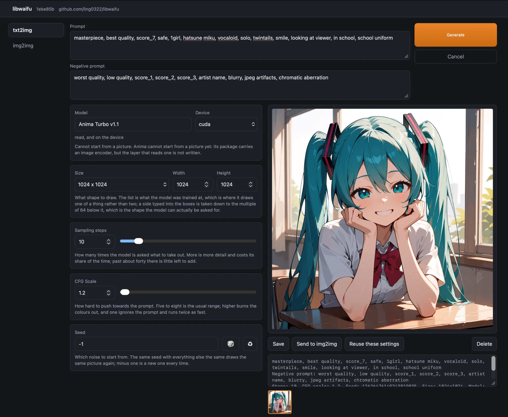

# libwaifu: draw your waifu on your own GPU

[](https://github.com/ling0322/libwaifu/actions/workflows/ci.yml)

libwaifu is an image generator that runs start to finish on your own machine. A prompt in, a
picture out -- SDXL, Anima, Krea 2 or Qwen-Image, painted by the GPU you already have, as fast as the
hardware allows. No API key, no cloud, no queue, and no one else seeing what you asked for.

## Supported models

| name | model | published as |
|---|---|---|
| `sdxl:base` | SDXL 1.0 base | \[🤗 [HF](https://huggingface.co/ling0322/libwaifu-sdxl-base-1.0)\] \[[MS](https://modelscope.cn/models/ling0322/libwaifu-sdxl-base-1.0)\] |
| `sdxl:illust` | Illustrious XL v2.0-STABLE | \[🤗 [HF](https://huggingface.co/ling0322/libwaifu-illustrious-xl-v2.0)\] \[[MS](https://modelscope.cn/models/ling0322/libwaifu-illustrious-xl-v2.0)\] |
| `sdxl:wai` | WAI-illustrious-SDXL v17.0 | \[🤗 [HF](https://huggingface.co/ling0322/libwaifu-wai-illustrious-v17)\] \[[MS](https://modelscope.cn/models/ling0322/libwaifu-wai-illustrious-v17)\] |
| `sdxl:noob` | NoobAI-XL v1.1 | \[🤗 [HF](https://huggingface.co/ling0322/libwaifu-noobai-xl-v1.1)\] \[[MS](https://modelscope.cn/models/ling0322/libwaifu-noobai-xl-v1.1)\] |
| `sdxl:obsession` | One Obsession v24 | \[🤗 [HF](https://huggingface.co/ling0322/libwaifu-one-obsession-v24)\] \[[MS](https://modelscope.cn/models/ling0322/libwaifu-one-obsession-v24)\] |
| `anima:turbo` | Anima Turbo v1.1 | \[🤗 [HF](https://huggingface.co/ling0322/libwaifu-anima-turbo-v1.1)\] \[[MS](https://modelscope.cn/models/ling0322/libwaifu-anima-turbo-v1.1)\] |
| `anima:miaomiao` | MiaoMiao Harem Anima v1.6 | \[🤗 [HF](https://huggingface.co/ling0322/libwaifu-miaomiao-harem-v1.6)\] \[[MS](https://modelscope.cn/models/ling0322/libwaifu-miaomiao-harem-v1.6)\] |
| `krea2:turbo` | Krea 2 Turbo | \[🤗 [HF](https://huggingface.co/ling0322/libwaifu-krea2-turbo)\] \[[MS](https://modelscope.cn/models/ling0322/libwaifu-krea2-turbo)\] |
| `krea2:turbo-fp8` | Krea 2 Turbo, quantized to FP8 | \[🤗 [HF](https://huggingface.co/ling0322/libwaifu-krea2-turbo)\] \[[MS](https://modelscope.cn/models/ling0322/libwaifu-krea2-turbo)\] |
| `qwen-image:2.1` | Qwen-Image 2.1 | \[🤗 [HF](https://huggingface.co/ling0322/libwaifu-qwen-image-2.1)\] \[[MS](https://modelscope.cn/models/ling0322/libwaifu-qwen-image-2.1)\] |
| `qwen-image:2.1-fp8` | Qwen-Image 2.1, quantized to FP8 | \[🤗 [HF](https://huggingface.co/ling0322/libwaifu-qwen-image-2.1)\] \[[MS](https://modelscope.cn/models/ling0322/libwaifu-qwen-image-2.1)\] |

## Supported voices

A voice is chosen on the text2speech tab the way a model is chosen on the other two, and fetched
off the same two hubs at the first reading. `-voice` chooses one before the page opens, as `-m`
does a model -- a name, or a manifest on the disk.

| name | model | published as |
|---|---|---|
| `indextts` | IndexTTS 2.5 | \[🤗 [HF](https://huggingface.co/ling0322/libwaifu-indextts-2.5)\] \[[MS](https://modelscope.cn/models/ling0322/libwaifu-indextts-2.5)\] |

## Low memory mode

`-device cuda_cpu_offload` keeps the weights in host memory and moves each one onto the card as it
is used, so a model far larger than the card still draws. It costs speed rather than the picture
-- the whole model crosses the bus once per step -- and it is never picked for you, because a card
the model does not fit on is something to be told about rather than worked around silently.

RTX 5060 Ti, 16 GB, card otherwise free. `krea2:turbo-fp8`, 1024x1024, the eight steps the
distilled release is for, seed 7:

| `-device` | peak GPU memory | outcome | wall |
|---|---|---|---|
| `cuda` | 15.4 GB | `Aborted: out of memory` | - |
| `cuda_cpu_offload` | 1.2 GB | a picture | 67 s |

## Run

`webui` is the only command, and it opens a page in a browser rather than drawing and exiting:

```bash
$ waifu webui
waifu is at http://127.0.0.1:7860
```



The page has three tabs: txt2img, img2img, and text2speech -- see
[Supported voices](#supported-voices) above.

## Recent updates

- [2026-09-23] Qwen-Image 2.1 is published, as `qwen-image:2.1` and `qwen-image:2.1-fp8` -- a
  fourth architecture, Built with Qwen. Its licence is non-commercial (research and evaluation)
  only; see [docs/qwen_image.md](docs/qwen_image.md#licensing).
- [2026-09-23] IndexTTS-2.5 speaks here, as `indextts` -- the first published voice, and the
  text2speech tab's first real model.
- [2026-09-23] MiaoMiao Harem v1.6 is published, as `anima:miaomiao` -- an Anima fine tune, mirrored
  here with the author's permission for this specific conversion.
- [2026-09-18] Krea 2 Turbo draws here: a third architecture, exported from the gated release
  rather than published from this repository.
- [2026-09-15] The screen is a page in a browser rather than a screenful of terminal: txt2img and
  img2img, the models to fetch across the top, and the picture where it can actually be looked at.
- [2026-09-15] Anima Turbo v1.1 is published, as `anima:turbo` -- the first model here that is not
  an SDXL one.
- [2026-09-05] NoobAI-XL v1.1 is published, as `sdxl:noob`.
- [2026-08-30] Metal, through MLX: a macOS build draws on the GPU rather than the CPU.
- [2026-08-29] WAI Illustrious v17.0 is published too, as `sdxl:wai`.

## Supported platforms

| OS       |  Platform | CUDA       | Metal  |  avx2  |  avx512 | asimdhp | asimdfhm |
|----------|-----------|------------|--------|--------|---------|---------|----------|
| Linux    | x64       | ✅         |        | ✅     | ✅       |         |          |
| Windows  | x64       | ✅         |        | ✅     | ✅       |         |          |
| macOS    | arm64     |            | ✅     |        |         | ✅      | ✅        |

The GPU column a machine has is the one `waifu` picks on its own -- CUDA first, then Metal,
and the CPU kernels when there is neither. Metal is compiled in by `-DWITH_MLX=ON` and macOS is
the only host that configures with it.

The two aarch64 kernels are one choice, not two: FEAT_FHM is optional in ARMv8.2, so the half
GEMM has a kernel whether or not the part has `fmlal`, and the backend is picked at startup by
which one it finds. The x64 pair works the same way, AVX-512 where the ISA is there and AVX2
otherwise.

### Devices

| `-device` | what it means |
|---|---|
| `auto` | The first accelerator this build has -- CUDA, then Metal -- and the CPU where there is neither. The default, and never `cuda_cpu_offload`: that one is for a card the model does not fit on, which is not a thing to decide on someone's behalf. |
| `cpu` | The CPU kernels. |
| `cuda` | The card, weights moved once and kept there. |
| `cuda_cpu_offload` | Weights stay in host memory and each is moved onto the card as it is used, so a model larger than the card still draws. Slower: the whole model crosses the bus once per step. Also spelled `cuda-cpu-offload`. |
| `metal` | The GPU on Apple Silicon, through MLX. |

A build only has the devices it was configured with, so `cuda` on a `-DWITH_CUDA=OFF` build is a
device that is not there. See the matrix above and the build section below.

## Rust example

The Rust API reads a model and hands back an image:

```rust
use waifu::{to_rgb8, Device, GenerationOptions, Manifest, Residency, Sdxl};

fn main() -> Result<(), waifu::Error> {
	let manifest = Manifest::open("sdxl.yaml")?;
	let model = Sdxl::from_manifest(Device::Cuda, Residency::Device, &manifest)?;

	let options = GenerationOptions {
		width: 1024,
		height: 1024,
		num_steps: 30,
		guidance_scale: 5.0,
		seed: Some(7),
		..Default::default()
	};

	let image = model.generate("a photo of an astronaut riding a horse on mars", &options)?;

	// Three bytes a pixel, row by row, ready for whatever writes the file.
	let pixels = to_rgb8(&image)?;
	println!("{} bytes, {} by {}", pixels.len(), options.width, options.height);
	Ok(())
}
```

`Anima::from_manifest`, `Krea2::from_manifest` and `QwenImage::from_manifest` are the same call
for the other three families, and `manifest.section("model")` says which one a manifest holds, so
a reader that handles all four asks it first. What differs is the
numbers rather than the code: Anima's turbo release is distilled for few steps at no guidance and
comes out burnt at the thirty and five SDXL likes, so take a model's own `suggested:` block over
the defaults where it has one.

`Sdxl::generate_reporting` is the same run with a reporter that hears how far along it is and can
stop it between steps, which is what the `webui` command is built on.

After completing the build steps below, run the complete example with:

```bash
cargo run --release -p waifu --example generate -- \
	sdxl.yaml \
	"a photo of an astronaut riding a horse on mars"
```

It takes an optional third argument -- `cpu`, `cuda` or `metal` -- and takes the first accelerator
this build can reach when that is left out. See
[waifu/examples/generate.rs](waifu/examples/generate.rs) for the complete source.

## Build

CMake drives the whole build. Configuring picks the native Flint C++/CUDA options -- which
backends to compile, where CUDA lives, what the third_party prerequisites resolve to -- and
`cmake --build` does the rest: it builds `libflint.a`, then runs `cargo build` to link it into
`waifu` and the `waifu` binary.

Requirements:

- CMake 3.22 or newer
- A C++17 compiler
- Rust and Cargo
- OpenMP, unless configured with `-DWITH_OPENMP=OFF`
- On Linux, `make` and a network connection the first time: CMake downloads and builds
  libunwind itself, into the build directory. The tarball is kept in `third_party/libunwind`,
  so later build directories reuse it rather than fetching it again.

### CPU build

A CPU build draws too, which it did not until the convolution and the two normalizations were
written for it. On a 32 thread machine 512 by 512 at 20 steps takes two and a half minutes, and
the model wants 13.7 GB rather than the 6.97 GB it is on disk: x64 has no half kernels, so the
weights are widened to float32 as they are read. That is also why it is the more accurate of the
two -- float32 throughout, against a float32 reference, is 1.3e-4 where the half path is 2.1e-2.

```bash
cmake -S . -B build -DWITH_CUDA=OFF
cmake --build build --parallel
```

The command-line executable is written to:

```text
build/waifu
```

### CUDA build

Install the CUDA Toolkit first. CUTLASS is a build-time prerequisite -- it is a header library,
but not a vendored one, so clone it first:

```bash
cd third_party && ./install_cutlass.sh && cd ..

cmake -S . -B build \
	-DWITH_CUDA=ON \
	-DCUDA_ARCH_NATIVE=ON
cmake --build build --parallel
```

### FlashAttention

FlashAttention is off by default: its kernels cost several minutes of `nvcc` per architecture,
and a CUDA build without them still runs attention through the block-wise fallback. To use it,
build the kernels once, then configure with `WITH_FLASH_ATTN`:

```bash
./third_party/install_flash_attn.sh
cmake -S . -B build -DWITH_CUDA=ON -DWITH_FLASH_ATTN=ON
```

`WITH_FLASH_ATTN` requires `WITH_CUDA=ON`. Paged attention, which the KV cache uses, lives
only in the FlashAttention path.

### macOS

Install OpenMP first, then configure with `-DWITH_MLX=ON` for Metal. CMake builds MLX itself, as
an `ExternalProject`, and the Metal kernels end up inside the binary rather than beside it:

```bash
brew install libomp
export OpenMP_ROOT="$(brew --prefix)/opt/libomp"

cmake -S . -B build -DWITH_CUDA=OFF -DWITH_MLX=ON
cmake --build build --parallel
```

Leave `-DWITH_MLX=ON` out for a CPU-only build.

### Tests

Run the native C++/CUDA test suite:

```bash
cmake --build build --target unittest --parallel
./build/unittest
```

Run the Rust tests. These read the link flags CMake already wrote out, so they work without
re-running `cmake --build` -- just be sure `build/` reflects the latest C++ if you edited a kernel.
`--features cli` is what compiles `waifu/src/cli`, and without it none of the command line is
tested:

```bash
cargo test -p waifu --features cli
```

The ignored Rust CUDA integration tests can be run on a CUDA machine with:

```bash
cargo test -p waifu --test tensor_cuda -- --ignored
```

The model tests are `#[ignore]`d too, and are a different kind of slow: each wants a real published
model under `models/` and puts a whole one on the card. Run a family at a time, on a machine with
both:

```bash
# SDXL
cargo test --release -p waifu --no-fail-fast \
	--test sdxl --test sdxl_unet --test sdxl_vae --test sdxl_text_encoder \
	--test sdxl_tokenizer --test sdxl_sampler -- --ignored --test-threads=1

# Anima
cargo test --release -p waifu --no-fail-fast \
	--test anima --test anima_pipeline --test anima_tokenizer -- --ignored --test-threads=1

# Krea 2
cargo test --release -p waifu --no-fail-fast \
	--test krea2 --test krea2_sampler --test krea2_pipeline --test krea2_tokenizer \
	-- --ignored --test-threads=1

# Qwen-Image
cargo test --release -p waifu --no-fail-fast \
	--test qwen_image --test qwen_image_pipeline --test qwen_image_tokenizer \
	-- --ignored --test-threads=1
```

Neither flag is optional. `--test-threads=1` keeps one model on the card at a time, where cargo
would otherwise start one per core, and `--no-fail-fast` keeps a failure in one test binary from
stopping the ones after it. Leave `--features cli` off these: nothing under `waifu/src/cli` is
reached from `tests/`, and asking for it drags hyper and rustls through a release compile first.
One GPU means one job -- a second checkout running these at the same time reports `Aborted: out of
memory`, which reads as a code failure and is not one.
